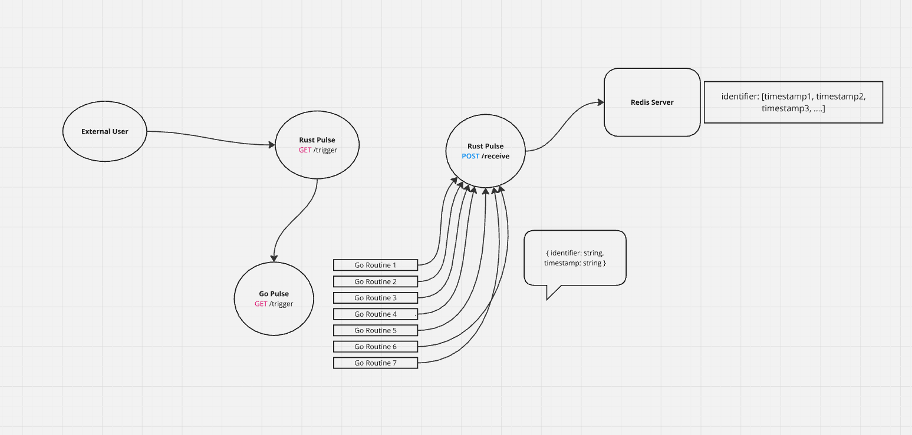

# go-rust-pulse

## Prerequisites
1. Rust
2. Golang
3. Redis

## Setup

1. To setup go-pulse, please refer to [go-pulse README](go-pulse/README.md)

2. To setup rust-pulse, please refer to [rust-pulse README](rust-pulse/README.md)

## 📝 License
This project is open-source and available under the [MIT LICENSE](LICENSE).
